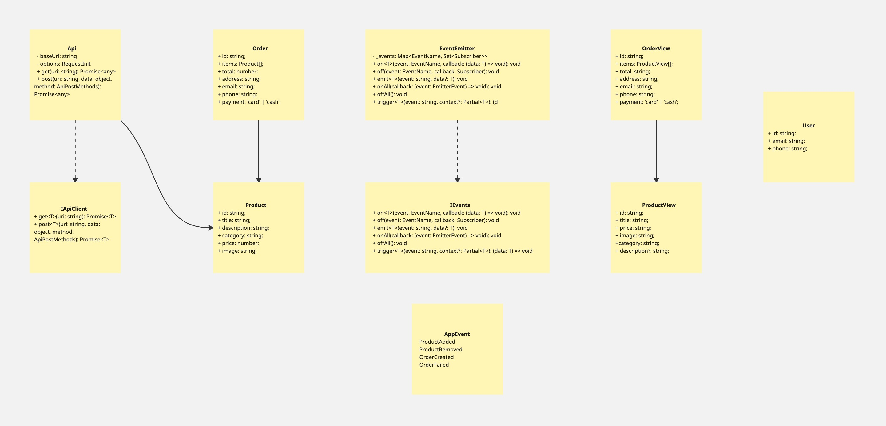

# Проектная работа "Веб-ларёк" 🛒


_UML-схема архитектуры проекта_

## 📝 Описание

Интернет-магазин с товарами для веб-разработчиков — Web-ларёк. В нём можно посмотреть каталог товаров, добавить товары в корзину и сделать заказ. В проекте используется классовая структура и архитектура MVP.

## 🚀 Быстрый старт

### Установка зависимостей

```bash
npm install
# или
yarn
```

### Запуск в режиме разработки

```bash
npm run start
# или
yarn start
```

## 🗂️ Ключевые файлы

- `src/pages/index.html` — HTML-файл главной страницы
- `src/types/index.ts` — файл с типами
- `src/index.ts` — точка входа приложения
- `src/scss/styles.scss` — корневой файл стилей
- `src/utils/constants.ts` — файл с константами
- `src/utils/utils.ts` — файл с утилитами

---

## 🛠️ Технологический стек

- **Frontend:** HTML, SCSS, TypeScript
- **Сборка:** Webpack, PostCSS, Babel
- **Пакетный менеджер:** npm/yarn
- **Форматирование:** Prettier
- **Среда выполнения:** Node.js

---

## 🏗️ Архитектура

В проекте используется классовая структура — сущности реализованы как классы, которые инкапсулируют данные и методы. Архитектура построена по принципу **MVP**:

- **Model** — отвечает за данные
- **View (Компоненты)** — отвечает за отображение
- **Presenter** — посредник между Model и View, управляет логикой взаимодействия, обрабатывает события, обновляет View

### Классы Model

#### ApiModel

**Назначение:** Наследуется от класса `Api`, обеспечивает взаимодействие с сервером для получения и отправки данных.

**Методы:**

- `getProductList` — получает массив карточек товаров с сервера
- `placeOrder` — отправляет заказ на сервер и получает результат обработки

#### BasketModel

**Назначение:** управляет данными корзины покупок, хранит и обрабатывает информацию о выбранных товарах.
**Конструктор:** инициализирует пустой массив items (типа Product[]), который будет хранить товары в корзине.

**Методы:**

- `getItemsCount` — возвращает количество товаров в корзине
- `getTotalPrice` — вычисляет общую сумму товаров в корзине (в синапсах)
- `addItemToCart` — добавляет товар в корзину
- `removeFromBasket` — удаляет товар из корзины по ID
- `clearBasketProducts` — очищает корзину полностью

#### DataCatalog

**Назначение:** Хранит и управляет данными о товарах, полученными с сервера.

**Методы:**

- `setDataPreview(item: Product): void` — получает данные о карточке товара, которую просматривает пользователь

#### OrderForm

**Назначение:** Управляет данными форм заказа, включая валидацию пользовательского ввода.

**Методы:**

- `setDeliveryAddress()` — сохраняет адрес доставки
- `setPaymentMethod()` - cохраняет email и телефон пользователя
- `validateContacts()` — проверяет корректность контактных данных
- `validateOrder()` — проверяет корректность адреса и способа оплаты
- `getOrderData()` — возвращает все данные формы заказа, включая email и телефон

### Классы View

#### BasketView

**Назначение:** Управляет отображением содержимого в корзине.
**Конструктор:** инициализирует объект, находя и сохраняя все необходимые DOM-элементы корзины для дальнейшей работы с ними в методах класса
**Методы:**

- `renderItems()`- отображает список товаров в корзине.
- `updateCartItemCount()` - обновляет количество товаров.
- `updateCartTotal()` - обновляет сумму всех товаров

#### ProductView

**Назначение:** Класс отвечает за визуализацию карточки товара на веб-странице. Инкапсулирует работу с DOM-элементами карточки и предоставляет методы для обновления её содержимого: названия, категории, цены, изображения и других данных.

**Методы:**

- `setElementText()`- устанавливает текстовое содержимое для переданного HTML-элемента.
- `setCategoryClass()`- устанавливает обработчик для кнопки "Добавить в корзину"
- `getPriceString()` - преобразует числовое значение цены в строку для отображения на карточке (например, "2 500 синапсов").
- `render()` - метод для отрисовки карточки товара.

#### ProductPreview

**Назначение:** Класс наследует все методы и свойства от ProductView. Отображает подробную информацию о товаре в режиме превью. Позволяет пользователю ознакомиться с описанием товара и добавить его в корзину через соответствующую кнопку.
**Конструктор:** инициализирует объект, наследуя все свойства и методы от ProductView. должен находить и сохранять дополнительные элементы для отображения описания товара и кнопки "В корзину".

**Методы:**

- `setDescription()`- отображает подробное описание товара
- `onAddToCart()`- устанавливает обработчик для кнопки "Добавить в корзину"
- `render()` - переопределяет render, чтобы добавить описание и кнопку.

#### ModalView

**Назначение:** Класс управляет отображением модального окна на веб-странице. Позволяет открывать и закрывать окно, а также автоматически добавляет обработчик для кнопки закрытия. Инкапсулирует работу с DOM-элементом модального окна и обеспечивает базовую логику взаимодействия с пользователем.

**Методы:**

- `open()` - oткрывает модальное окно.
- `close()` - закрывает модальное окно.

#### PaymentModalView

**Назначение:** Класс управляет отображением модального окна с формой для выбора способа оплаты и ввода адреса доставки. Позволяет открывать и закрывать окно, получать и устанавливать значения формы, а также обрабатывать выбор метода оплаты, отправку формы и закрытие окна.

**Методы:**

- `onSubmit(callback: (payment: string, address: string) => void)` - устанавливает выбранный способ оплаты и адрес доставки в соответствующие поля формы.

#### ContactsModalView

**Назначение:** Класс управляет отображением модального окна с формой для ввода Email и номера телефона пользователя. Позволяет открывать и закрывать окно, получать и устанавливать значения полей формы, а также обрабатывать отправку формы.
**Конструктор:**
constructor(modalElement: HTMLElement) - должен инициализировать объект класса, клонируя шаблон формы, находить все необходимые элементы (поля ввода, кнопку отправки, блок ошибок)
и устанавливать обработчики событий для полей ввода и формы.
**Методы:**

- `render()` - возвращает DOM-элемент формы, который можно вставить в страницу

#### OrderSuccessModal

**Назначение:** отображение модального окна успешного заказа.
**Конструктор:**
constructor(modalElement: HTMLElement) - клонирует шаблон успешного заказа, находит DOM-элементы, устанавливает обработчик события на кнопку.
**Методы:**

- `render(total: number)` - устанавливает текст с указанием суммы (Списано ${total} синапсов) и
  возвращает готовый DOM-элемент (this.success) для вставки на страницу.

#### MainPageView

**Назначение:** отображение главной страницы интернет-магазина с корзиной и каталогом товаров
**Конструктор:**
constructor(root: HTMLElement) - инициализирует объект, находя и сохраняя все необходимые DOM-элементы главной страницы (кнопку корзины, счетчик, каталог), чтобы методы класса могли управлять их содержимым и отображением.

**Методы:**

- `onOpenCart(callback: () => void)` — обработчик клика по кнопке корзины.
- `updateCartCount(count: number)` — принимает число товаров.
- `renderCatalog(products: Product[])` — принимает массив товаров типа Product.

## Базовые классы:

### 📦 Класс Api

**Назначение:** Инкапсулирует работу с серверным API. Предоставляет методы для выполнения HTTP-запросов и обработки ответов.

**Поля:**

- `baseUrl` (строка, только для чтения): базовый URL для всех запросов
- `options` (protected): объект с настройками для fetch-запросов (`RequestInit`)

**Конструктор:**

constructor(baseUrl: string, options: RequestInit = {})

**Методы:**

- `handleResponse(response: Response): Promise<object>` — обработка ответа от сервера
- `get(uri: string): Promise<object>` — выполняет GET-запрос по указанному URI
- `post(uri: string, data: object, method: ApiPostMethods = 'POST'): Promise<object>` — выполняет POST/PUT/DELETE-запрос с передачей данных

### 🔔 Класс EventEmitter

**Назначение:** Обеспечивает работу событий. Позволяет объектам обмениваться событиями без прямой зависимости друг от друга.

**Поля:**

- `_events` (приватное): `Map<EventName, Set<Subscriber>>`

**Конструктор:**

```ts
constructor() {
    this._events = new Map<EventName, Set<Subscriber>>();
}
```

**Методы:**

- `on` — подписывает обработчик на событие
- `off` — удаляет обработчик события
- `emit` — вызывает все обработчики, подписанные на событие
- `onAll` — подписывает обработчик на все события
- `offAll` — удаляет все обработчики всех событий
- `trigger` — возвращает функцию, которая при вызове инициирует событие с аргументами

---

### Интерфейсы

`Product` Описывает товар в магазине: его идентификатор, название, описание, категорию, цену и изображение.
`ProductView` Расширяет Product для отображения на экране
`Order` Описывает заказ: его идентификатор, список товаров, сумму, адрес, контакты и способ оплаты.
`OrderView` Расширяет Order для отображения на экране
`User` Описывает пользователя, который делает заказ
`IApiClient` Реализует методы для получения и отправки данных на сервер
`ApiListResponse<Type>` Описывает ответ от API при получении списка объектов
`enum AppEvent` Список событий. Событие отражает ключевое действие пользователя или изменение состояния приложения
